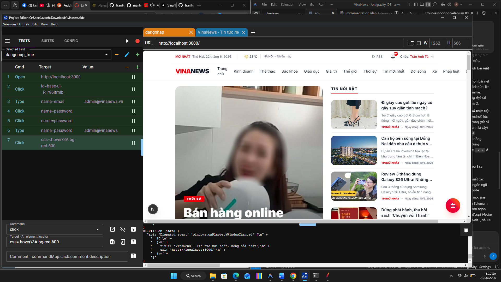
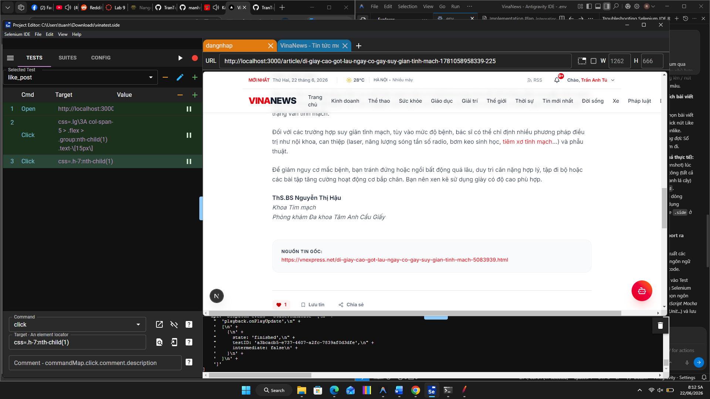
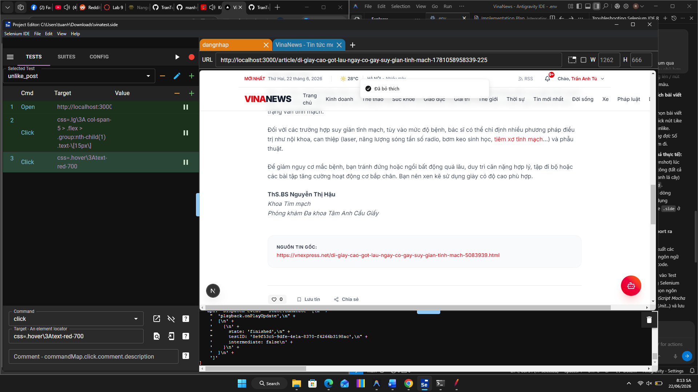

# BÁO CÁO BÀI TẬP THỰC HÀNH: KIỂM THỬ TỰ ĐỘNG VỚI SELENIUM IDE

Bài báo cáo này trình bày quá trình thực hành xây dựng các kịch bản kiểm thử tự động (Automated Test Cases) bằng công cụ **Selenium IDE** trên hệ thống tin tức **VinaNews**.

---

## 1. Thông tin chung
*   **Họ và tên:** [Họ và tên của bạn]
*   **Mã sinh viên:** [Mã sinh viên của bạn]
*   **Công cụ kiểm thử:** Selenium IDE (Desktop Application)
*   **Website kiểm thử:** VinaNews (chạy trên môi trường local: `http://localhost:3000`)
*   **Số lượng Test Case:** 03 test kịch bản kiểm thử (bao gồm Đăng nhập, Thích bài viết, và Bỏ thích bài viết).

---

## 2. Cấu trúc thư mục của Repo
Để chạy các test case này, các tệp tin trong repository được tổ chức như sau:
```text
├── VinaNews_Selenium_Tests.side     # File lưu dự án Selenium IDE chứa toàn bộ test case
├── README.md                         # Báo cáo kết quả kiểm thử (File này)
```

---

## 3. Danh sách các Kịch bản kiểm thử (Test Cases)

### Kịch bản 1: Đăng nhập hệ thống (dangnhap_true)
*   **Mục tiêu:** Kiểm tra chức năng đăng nhập hoạt động chính xác với thông tin tài khoản hợp lệ.
*   **Các bước thực hiện (Test Steps):**
    1. `open` - Mở trang chủ: `http://localhost:3000/`
    2. `click` - Click vào biểu tượng Avatar/Nút Đăng nhập trên thanh điều hướng (`id=base-ui-_R_r96itmlb_`).
    3. `type` - Nhập Email: `admin@vinanews.vn` vào ô nhập email (`name=email`).
    4. `click` - Click vào ô nhập mật khẩu (`name=password`).
    5. `type` - Nhập Password: `admin@vinanews.vn` (`name=password`).
    6. `click` - Click vào nút "ĐĂNG NHẬP NGAY" (`css=.hover\3A bg-red-600`).
*   **Kết quả kỳ vọng (Expected Result):** Đăng nhập thành công, hiển thị lời chào `"Chào, Trần Anh Tú"` ở góc trên bên phải màn hình.
*   **Kết quả thực tế (Actual Result):** **ĐẠT (PASS)** - Đăng nhập thành công, tài khoản hiển thị chính xác.

---

### Kịch bản 2: Thích bài viết (like_post)
*   **Mục tiêu:** Kiểm tra chức năng Like bài viết hoạt động chính xác sau khi người dùng đã đăng nhập.
*   **Tiền điều kiện:** Người dùng đã đăng nhập thành công vào hệ thống.
*   **Các bước thực hiện (Test Steps):**
    1. `open` - Mở trang chủ: `http://localhost:3000/`
    2. `click` - Click chọn bài viết đầu tiên nổi bật tại trang chủ để vào trang chi tiết bài viết.
    3. `click` - Cuộn xuống cuối bài viết và click nút Thích (Trái tim) (`css=.h-7:nth-child(1)`).
*   **Kết quả kỳ vọng (Expected Result):** Số lượt thích tăng lên 1 đơn vị, nút Thích chuyển sang trạng thái đã thích (màu đỏ).
*   **Kết quả thực tế (Actual Result):** **ĐẠT (PASS)** - Hệ thống ghi nhận lượt thích thành công.

---

### Kịch bản 3: Bỏ thích bài viết (unlike_post)
*   **Mục tiêu:** Kiểm tra chức năng Bỏ thích (Unlike) hoạt động chính xác đối với bài viết đã được thích trước đó.
*   **Tiền điều kiện:** Người dùng đang ở trang chi tiết bài viết và bài viết đó đã được thả tim (like).
*   **Các bước thực hiện (Test Steps):**
    1. `open` - Mở trang chi tiết bài viết.
    2. `click` - Click nút Thích lần nữa để thực hiện bỏ thích (`css=.hover\3Atext-red-700`).
*   **Kết quả kỳ vọng (Expected Result):** Hệ thống hiển thị thông báo toast `"Đã bỏ thích"` ở đầu trang, số lượt thích giảm đi 1 đơn vị.
*   **Kết quả thực tế (Actual Result):** **ĐẠT (PASS)** - Bỏ thích thành công, hiển thị thông báo phản hồi chính xác.

---

## 4. Hướng dẫn chạy Test Suite bằng Selenium IDE

1. **Chuẩn bị môi trường:**
   * Tải và cài đặt ứng dụng **Selenium IDE** (Bản Desktop hoặc Extension trên trình duyệt phù hợp).
   * Khởi động dự án **VinaNews** trên local tại địa chỉ `http://localhost:3000`.

2. **Chạy kiểm thử:**
   * Mở ứng dụng **Selenium IDE**.
   * Chọn **Open an existing project** và tìm đến tệp tin `VinaNews_Selenium_Tests.side` trong thư mục này.
   * Chọn Test Suite hoặc Test Case bạn muốn kiểm thử từ thanh bên trái.
   * Nhấn nút **Run current test** (Biểu tượng Play) ở phía trên để tự động chạy các thao tác.
   * Xem kết quả chạy tại bảng điều khiển bên dưới (Màu xanh là Pass, Màu đỏ là Fail).
